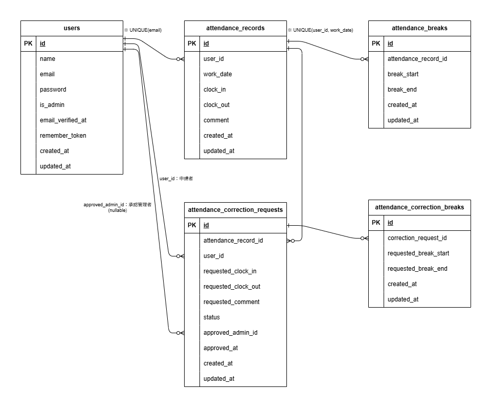

# 勤怠管理アプリ

勤怠管理アプリは、一般ユーザーの出勤・休憩・退勤の打刻、勤怠一覧確認、勤怠修正申請、管理者による勤怠確認・修正・申請承認ができるアプリケーションです。

一般ユーザーは会員登録後、メール認証を完了することで勤怠機能を利用できます。
管理者は専用ログイン画面からログインし、全スタッフの勤怠確認、スタッフ別月次勤怠確認、CSV出力、修正申請の承認を行うことができます。

また、応用機能として、勤怠レポート画面、公開API、Laravel SanctumによるAPIトークン認証、Policyによる認可制御を実装しています。

## 環境構築

### Dockerビルド

1. リポジトリをクローンします。

```bash
git clone git@github.com:marikoinukai/mock2-attendance-management.git
```

2. プロジェクトディレクトリへ移動します。

```bash
cd mock2-attendance-management
```

3. Docker Desktopを起動します。

4. Dockerコンテナを起動します。

```bash
docker compose up -d --build
```

### Laravel環境構築

1. PHPコンテナ内でComposerを実行します。

```bash
docker compose exec php composer install
```

2. `.env.example` をコピーして `.env` を作成します。

```bash
cp src/.env.example src/.env
```

3. `.env` に以下の環境変数を設定します。

```env
DB_CONNECTION=mysql
DB_HOST=mysql
DB_PORT=3306
DB_DATABASE=laravel_db
DB_USERNAME=laravel_user
DB_PASSWORD=laravel_pass

MAIL_MAILER=smtp
MAIL_HOST=mailhog
MAIL_PORT=1025
MAIL_FROM_ADDRESS=example@example.com
MAIL_FROM_NAME="${APP_NAME}"
```

4. アプリケーションキーを作成します。

```bash
docker compose exec php php artisan key:generate
```

5. マイグレーションを実行します。

```bash
docker compose exec php php artisan migrate
```

6. シーディングを実行します。

```bash
docker compose exec php php artisan db:seed
```

7. キャッシュをクリアします。

```bash
docker compose exec php php artisan config:clear
docker compose exec php php artisan cache:clear
docker compose exec php php artisan view:clear
```

## トラブルシューティング

### 権限エラーが発生する場合

環境によっては、`storage` や `bootstrap/cache` の書き込み権限が不足し、permission denied エラーが発生することがあります。

その場合は、以下を実行してください。

```bash
docker compose exec php chmod -R 777 storage bootstrap/cache
docker compose exec php php artisan config:clear
docker compose exec php php artisan cache:clear
docker compose exec php php artisan view:clear
```

### データベースを作り直したい場合

以下のコマンドで、テーブルをすべて作り直し、Seederでダミーデータを再作成できます。

```bash
docker compose exec php php artisan migrate:fresh --seed
```

`migrate:fresh` は既存のテーブルを削除して再作成するため、登録済みデータはすべて削除されます。

## 認証機能について

- 会員登録、ログイン、ログアウト、メール認証は Laravel Fortify を用いて実装しています。
- 一般ユーザーは `/login` からログインします。
- 管理者ユーザーは `/admin/login` からログインします。
- メール未認証の一般ユーザーは、勤怠画面にアクセスできず、メール認証誘導画面へリダイレクトされます。
- APIの書き込み系処理では Laravel Sanctum によるAPIトークン認証を使用しています。

## 追加仕様・バリデーション

ユーザー名は、クライアントとの相談により20文字以内に制限しています。

### 主なバリデーション

| 対象           | 項目           | バリデーション                                       |
| -------------- | -------------- | ---------------------------------------------------- |
| 会員登録       | 名前           | 入力必須、20文字以内                                 |
| 会員登録       | メールアドレス | 入力必須、メール形式、重複不可                       |
| 会員登録       | パスワード     | 入力必須、8文字以上、確認用パスワードと一致          |
| 一般ログイン   | メールアドレス | 入力必須、文字列、一般ユーザーアカウントであること   |
| 一般ログイン   | パスワード     | 入力必須、文字列                                     |
| 管理者ログイン | メールアドレス | 入力必須、メール形式、管理者アカウントであること     |
| 管理者ログイン | パスワード     | 入力必須                                             |
| 勤怠修正申請   | 出勤・退勤時刻 | 入力必須、出勤時刻が退勤時刻以前                     |
| 勤怠修正申請   | 休憩時刻       | 休憩開始・終了をセットで入力、出勤・退勤時刻の範囲内 |
| 勤怠修正申請   | 備考           | 入力必須、最大255文字                                |
| 管理者勤怠修正 | 出勤・退勤時刻 | 入力必須、出勤時刻が退勤時刻以前                     |
| 管理者勤怠修正 | 休憩時刻       | 休憩開始・終了をセットで入力、出勤・退勤時刻の範囲内 |
| 管理者勤怠修正 | 備考           | 入力必須、最大255文字                                |

### 画面表示・並び順の補足仕様

- 管理者がログインした場合の「日次勤怠一覧画面」では、選択日の勤怠データが存在する一般スタッフのみを表示します。選択日の勤怠データが存在しないスタッフは表示しません。
- 「修正申請一覧画面」では、一般ユーザー・管理者ともに、対象日時が古い順、つまり昇順になるように表示しています。同じ対象日時の申請が複数ある場合は、申請日時が古い順に表示します。

## ダミーデータ

本アプリケーションでは、開発・動作確認用のダミーデータをSeederで作成しています。

### 作成されるユーザー

| 種別           | 名前      | メールアドレス                                | パスワード | メール認証 | 管理者権限 |
| -------------- | --------- | --------------------------------------------- | ---------- | ---------- | ---------- |
| 一般ユーザー   | ユーザー1 | [user1@example.com](mailto:user1@example.com) | password   | 認証済み   | なし       |
| 一般ユーザー   | ユーザー2 | [user2@example.com](mailto:user2@example.com) | password   | 認証済み   | なし       |
| 管理者ユーザー | ユーザー3 | [user3@example.com](mailto:user3@example.com) | password   | 認証済み   | あり       |

管理者ユーザーは、`users` テーブルの `is_admin` カラムを `true` に設定しています。

### 作成される勤怠データ

全ユーザーに対して、勤怠記録と休憩記録のダミーデータを作成しています。

#### ユーザー1の勤怠データ

ユーザー1には、勤怠集計画面の確認用として、以下の意図的なデータを作成しています。

- 過去5ヶ月分：各月の平日15日分、合計75日分
- 当月分：17日分
- 合計：92日分
- 全勤怠に固定休憩 `12:00〜13:00` を付与

当月分の内訳は以下の通りです。

| 勤務パターン | 件数 | 勤務時間     |
| ------------ | ---: | ------------ |
| 通常勤務     | 10日 | 09:00〜18:00 |
| 残業         |  3日 | 09:00〜20:00 |
| 遅刻         |  2日 | 09:30〜18:00 |
| 早退         |  1日 | 09:00〜17:00 |
| 長時間労働   |  1日 | 08:00〜21:00 |

#### ユーザー2・ユーザー3の勤怠データ

ユーザー2とユーザー3には、画面表示確認用として、それぞれ30日分の勤怠データを作成しています。

- ユーザー2：30日分
- ユーザー3：30日分

### 勤怠集計画面の確認用データ

ユーザー1でログインし、`/attendance/report` を開いた場合、以下の値になる想定です。

| 項目                         |   予測値 |
| ---------------------------- | -------: |
| 過去6ヶ月の総労働時間        |  744時間 |
| 過去6ヶ月の総残業時間        |   10時間 |
| 過去6ヶ月の平均労働時間 / 日 | 8時間5分 |
| 当月の遅刻回数               |      2回 |
| 当月の早退回数               |      1回 |
| 当月の長時間労働回数         |      1日 |

※ 残業時間は、1日の労働時間が8時間を超えた分で計算しています。
※ 長時間労働は、1日の労働時間が10時間を超えた日として判定しています。

### ダミーデータの作成方法

以下のコマンドで、データベースを作り直し、Seederでダミーデータを作成します。

```bash
docker compose exec php php artisan config:clear
docker compose exec php php artisan migrate:fresh --seed
```

既存データを残したまま勤怠ダミーデータのみ作成したい場合は、以下を実行します。

```bash
docker compose exec php php artisan db:seed --class=DummyAttendanceSeeder
```

## 使用技術

- PHP 8.1.34
- Laravel 8.83.8
- MySQL 8.0.26
- nginx 1.21.1
- Docker / Docker Compose
- Laravel Fortify
- Laravel Sanctum
- MailHog
- PHPUnit

## 主な機能

### 一般ユーザー機能

- 会員登録
- ログイン / ログアウト
- メール認証
- 出勤打刻
- 休憩開始 / 休憩終了
- 退勤打刻
- 勤怠一覧表示
- 勤怠詳細表示
- 勤怠修正申請
- 修正申請一覧表示
- 勤怠レポート表示

### 管理者機能

- 管理者ログイン / ログアウト
- 日次勤怠一覧表示
- 勤怠詳細表示
- 勤怠直接修正
- スタッフ一覧表示
- スタッフ別月次勤怠一覧表示
- スタッフ別勤怠CSV出力
- 修正申請一覧表示
- 修正申請承認

### API機能

- 勤怠一覧取得API
- 勤怠詳細取得API
- 勤怠登録API
- 勤怠更新API
- 勤怠削除API
- SanctumによるAPIトークン認証
- Policyによる本人または管理者のみの更新・削除制御

## 主なテーブル

- users
- attendance_records
- attendance_breaks
- attendance_correction_requests
- attendance_correction_breaks
- personal_access_tokens

## URL

| 内容                 | URL                                            |
| -------------------- | ---------------------------------------------- |
| 開発環境             | http://localhost/                              |
| 会員登録             | http://localhost/register                      |
| 一般ユーザーログイン | http://localhost/login                         |
| 管理者ログイン       | http://localhost/admin/login                   |
| 勤怠打刻画面         | http://localhost/attendance                    |
| 勤怠一覧画面         | http://localhost/attendance/list               |
| 勤怠レポート画面     | http://localhost/attendance/report             |
| 修正申請一覧画面     | http://localhost/stamp_correction_request/list |
| MailHog              | http://localhost:8025/                         |
| phpMyAdmin           | http://localhost:8080/                         |

## 公開API

本アプリケーションでは、勤怠情報を外部アプリケーションから取得・操作するための公開APIを実装しています。

APIのURLは `/api/v1` から始まります。

### 勤怠APIエンドポイント

| メソッド    | URL                                             | 認証 | 内容         |
| ----------- | ----------------------------------------------- | ---- | ------------ |
| GET         | `/api/v1/attendance-records`                    | 不要 | 勤怠一覧取得 |
| GET         | `/api/v1/attendance-records/{attendanceRecord}` | 不要 | 勤怠詳細取得 |
| POST        | `/api/v1/attendance-records`                    | 必要 | 勤怠登録     |
| PUT / PATCH | `/api/v1/attendance-records/{attendanceRecord}` | 必要 | 勤怠更新     |
| DELETE      | `/api/v1/attendance-records/{attendanceRecord}` | 必要 | 勤怠削除     |

### 勤怠一覧取得

```bash
curl "http://localhost/api/v1/attendance-records?per_page=20"
```

使用できるクエリパラメータは以下です。

| パラメータ | 内容                                |
| ---------- | ----------------------------------- |
| `user_id`  | ユーザーIDで絞り込み                |
| `date`     | 日付で絞り込み。形式は `YYYY-MM-DD` |
| `month`    | 月で絞り込み。形式は `YYYY-MM`      |
| `page`     | ページ番号                          |
| `per_page` | 1ページあたりの件数。最大100件      |

レスポンス例です。

```json
{
  "data": [
    {
      "id": 1,
      "user_id": 1,
      "user_name": "ユーザー1",
      "date": "2026-06-01",
      "clock_in": "09:00:00",
      "clock_out": "18:00:00",
      "total_time": "08:00",
      "total_break_time": "01:00",
      "comment": "通常勤務"
    }
  ],
  "links": {},
  "meta": {
    "current_page": 1,
    "last_page": 1,
    "per_page": 20,
    "total": 1
  }
}
```

### 勤怠詳細取得

```bash
curl "http://localhost/api/v1/attendance-records/1"
```

レスポンス例です。

```json
{
  "data": {
    "id": 1,
    "user_id": 1,
    "user_name": "ユーザー1",
    "user": {
      "id": 1,
      "name": "ユーザー1"
    },
    "date": "2026-06-01",
    "clock_in": "09:00:00",
    "clock_out": "18:00:00",
    "total_time": "08:00",
    "total_break_time": "01:00",
    "comment": "通常勤務",
    "breaks": [
      {
        "id": 1,
        "break_in": "12:00:00",
        "break_out": "13:00:00"
      }
    ],
    "applications": []
  }
}
```

### API認証

勤怠の登録・更新・削除には、Laravel SanctumによるAPIトークン認証が必要です。

認証が必要なAPIでは、リクエストヘッダーに以下を指定します。

```text
Authorization: Bearer {APIトークン}
```

開発環境でAPIトークンを発行する例です。

```bash
docker compose exec php php artisan tinker
```

```php
$user = App\Models\User::find(1);
$user->createToken('api-test-token')->plainTextToken;
```

表示されたトークンを使って、以下のようにリクエストします。

```bash
curl -i -X POST "http://localhost/api/v1/attendance-records" \
-H "Content-Type: application/json" \
-H "Authorization: Bearer {APIトークン}" \
-d '{"date":"2026-07-01","clock_in":"09:00:00","clock_out":"18:00:00","comment":"API登録テスト"}'
```

### 勤怠登録リクエスト例

```json
{
  "date": "2026-07-01",
  "clock_in": "09:00:00",
  "clock_out": "18:00:00",
  "comment": "API登録テスト"
}
```

正常に登録された場合は、`201 Created` が返ります。

### 勤怠更新リクエスト例

```bash
curl -i -X PUT "http://localhost/api/v1/attendance-records/1" \
-H "Content-Type: application/json" \
-H "Authorization: Bearer {APIトークン}" \
-d '{"date":"2026-07-01","clock_in":"09:30:00","clock_out":"18:30:00","comment":"API更新テスト"}'
```

正常に更新された場合は、`200 OK` が返ります。

### 勤怠削除リクエスト例

```bash
curl -i -X DELETE "http://localhost/api/v1/attendance-records/1" \
-H "Authorization: Bearer {APIトークン}"
```

正常に削除された場合は、`204 No Content` が返ります。

### APIエラーレスポンス

存在しない勤怠IDを指定した場合は、`404 Not Found` が返ります。

```json
{
  "error": "勤怠情報が見つかりませんでした。"
}
```

未認証で登録・更新・削除を行った場合は、`401 Unauthorized` が返ります。

```json
{
  "message": "Unauthenticated."
}
```

他ユーザーの勤怠を更新・削除しようとした場合は、`403 Forbidden` が返ります。

```json
{
  "error": "この操作を実行する権限がありません。"
}
```

バリデーションエラーの場合は、`422 Unprocessable Content` が返ります。

```json
{
  "message": "勤怠日は必須です。",
  "errors": {
    "date": ["勤怠日は必須です。"]
  }
}
```

## PHPUnitテスト

本アプリケーションでは、テスト用データベースを使用してPHPUnitテストを実行します。
通常の開発用データベースとは別に、`attendance_test` をテスト用データベースとして使用します。

### テスト用データベースの作成

MySQLコンテナにログインします。

```bash
docker compose exec mysql mysql -u root -p
```

パスワードを求められた場合は、`root` を入力してください。

MySQLにログイン後、以下を実行します。

```sql
CREATE DATABASE IF NOT EXISTS attendance_test;
SHOW DATABASES;
exit;
```

### テスト用環境ファイル

テスト実行時は、`src/.env.testing` を使用します。
主な設定は以下の通りです。

```env
APP_ENV=testing
DB_CONNECTION=mysql_test
DB_HOST=mysql
DB_PORT=3306
DB_DATABASE=attendance_test
DB_USERNAME=root
DB_PASSWORD=root
```

また、`src/config/database.php` に `mysql_test` 接続設定を追加しています。

### テスト用テーブルの作成

以下のコマンドで、テスト用データベースにテーブルを作成します。

```bash
docker compose exec php php artisan config:clear
docker compose exec php php artisan migrate --env=testing
```

### テスト実行

全テストを実行する場合は、以下のコマンドを実行します。

```bash
docker compose exec php php artisan test
```

特定のテストファイルのみ実行する場合は、対象ファイルのパスを指定します。

```bash
docker compose exec php php artisan test tests/Feature/Auth/RegisterTest.php
docker compose exec php php artisan test tests/Feature/Auth/LoginTest.php
docker compose exec php php artisan test tests/Feature/Attendance/AttendanceStampTest.php
```

特定のテストメソッドのみ実行する場合は、`--filter` を使用します。

```bash
docker compose exec php php artisan test --filter=test_user_can_register
```

※ `tests/...` のパスはPHPコンテナ内でのパスです。`php artisan test` 実行時は `src/` を付けません。

### テスト実行結果

以下のコマンドで全テストが通過することを確認しています。

```bash
docker compose exec php php artisan test
```

確認時点の結果は以下です。

```text
Tests:  85 passed
```

### 作成済みテスト

本アプリケーションでは、以下のFeatureテストを作成しています。

- 会員登録テスト
- メール認証テスト
  - 会員登録後の認証メール送信
  - 未認証ユーザーのメール認証画面リダイレクト
  - 認証URLアクセス後のメール認証完了

- 一般ユーザーログインテスト
- 管理者ログインテスト
- 勤怠画面の日時表示・ステータス表示テスト
- 出勤・休憩・退勤テスト
- 一般ユーザー勤怠一覧テスト
- 一般ユーザー勤怠詳細テスト
- 勤怠修正申請テスト
- 管理者勤怠一覧テスト
- 管理者勤怠詳細・修正テスト
- 管理者修正申請承認テスト
- スタッフ一覧テスト
- スタッフ別勤怠一覧・CSV出力テスト
- 勤怠レポートテスト
- 公開APIテスト
  - 勤怠一覧取得API
  - 勤怠詳細取得API
  - 存在しない勤怠IDの404 JSON
  - 未認証時の401 JSON
  - 認証済みユーザーによる勤怠登録・更新・削除
  - 他ユーザー操作時の403 JSON

テストは主に `src/tests/Feature` 配下に配置しています。

### 補足

テストでは `RefreshDatabase` を使用しているため、各テストはテスト用データベースをリフレッシュしながら実行されます。
そのため、通常の開発用データベース `laravel_db` のデータには影響しません。

## ER図



※ `er.drawio` は編集用の元データです。
